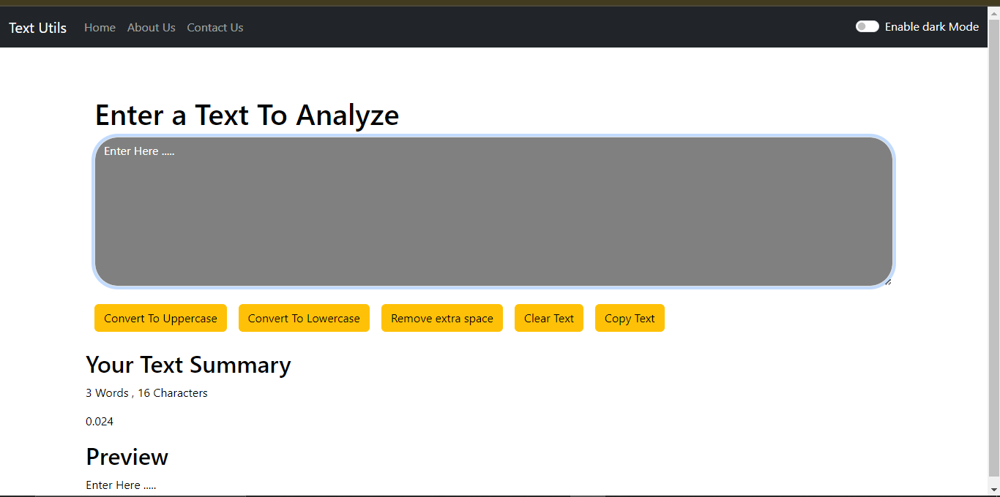
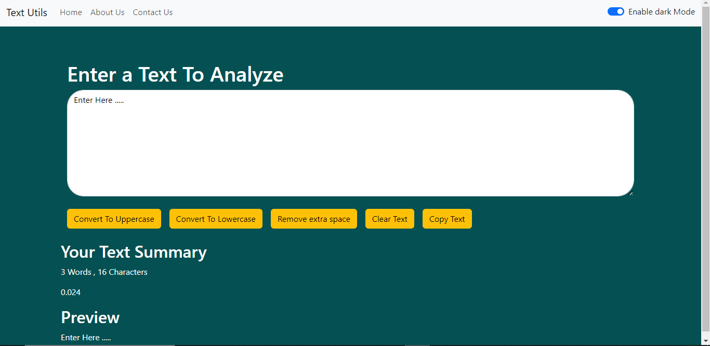

# Text Utils

Text Utils is a simple yet powerful text manipulation application built using React and Vite. It offers various features for text processing, including converting text to uppercase, lowercase, removing extra spaces, copying text to the clipboard, and clearing text. The application also includes a dark mode feature and navigation with React Router.

---

## Features

- **Uppercase Conversion**: Convert your text to uppercase with a single click.
- **Lowercase Conversion**: Convert your text to lowercase easily.
- **Copy Text**: Copy the processed text directly to the clipboard.
- **Clear Text**: Clear the entire text input quickly.
- **Remove Extra Spaces**: Remove unnecessary spaces between words in your text.
- **Word Count**: Display the total number of words in the input text.
- **Character Count**: Display the total number of characters in the input text.
- **Reading Time Estimation**: Estimate the time it would take to read the input text.
- **Dark Mode**: Toggle between light and dark themes for a better user experience.
- **React Router Integration**: Navigate between pages smoothly using React Router.

---

## Tech Stack

- **Frontend**: React with Vite setup
- **Styling**: CSS
- **Routing**: React Router
- **Icons**: React Icons

---

## Installation and Setup

Follow these steps to set up the project locally:

1. Clone the repository:
   ```bash
   git clone https://github.com/vishallokhande8788/text-utils.git
   ```

2. Navigate to the project directory:
   ```bash
   cd text-utils
   ```

3. Install dependencies:
   ```bash
   pnpm install
   ```

4. Start the development server:
   ```bash
   pnpm run dev
   ```

5. Open the app in your browser at `http://localhost:5173`.

---

## Usage

1. Open the application in your browser.
2. Enter the text you want to process in the input box.
3. Use the buttons to:
   - Convert text to uppercase or lowercase.
   - Copy the text to the clipboard.
   - Clear the input box.
   - Remove extra spaces.
   - View the word count, character count, and estimated reading time.
4. Toggle between light and dark modes using the switch at the top of the app.
5. Navigate through the app using the menu powered by React Router.

---

## Dependencies

The following dependencies are used in this project:

```json
"dependencies": {
    "react": "^18.x",
    "react-dom": "^18.x",
    "react-router-dom": "^6.x",
    "react-icons": "^4.x"
}
```


## Screenshots

### Light Mode:


### Dark Mode:


---

## Future Enhancements

- Add more text manipulation features (e.g. find and replace , ).
- Improve UI/UX design.
- Add multi-language support.

---

## Contributing

Contributions are welcome! Please follow these steps to contribute:

1. Fork the repository.
2. Create a new branch:
   ```bash
   git checkout -b feature-name
   ```
3. Make your changes and commit them:
   ```bash
   git commit -m "Add your message here"
   ```
4. Push to the branch:
   ```bash
   git push origin feature-name
   ```
5. Create a pull request.

---

## License

This project is licensed under the MIT License. See the [LICENSE](LICENSE) file for details.

---

## Acknowledgments

- [React](https://reactjs.org/)
- [Vite](https://vitejs.dev/)
- [React Router](https://reactrouter.com/)
- [React Icons](https://react-icons.github.io/react-icons/)
